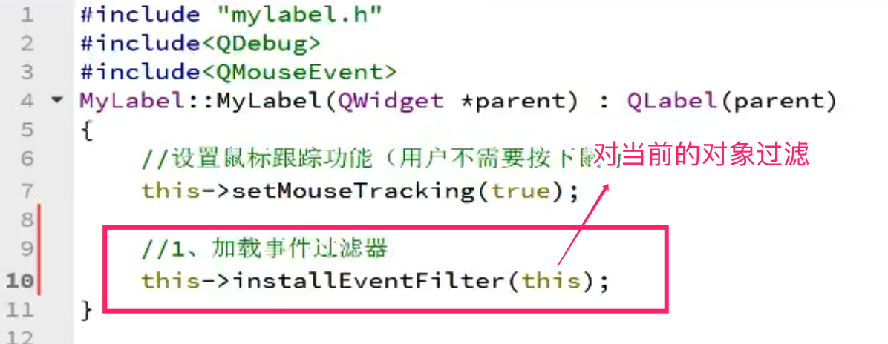

# QT Event Demo

qt event 事件学习


**Qt** **中所有事件类都继承于** **QEvent**。在事件对象创建 完毕后，Qt 将这个事件对象传递给 QObject 的 event()函数。**event()****函数并不 直接处理事件， 而是按照事件对象的类型分派给特定的事件处理函数（event handler）


## 重写QLabel事件示例

- 首先在界面上新建一个label, 然后给 label 设置一个边框  frameShape   是为了便于区分label区域

- 需要在自定义的Label控件中实现 父类的virtual 事件重写就必须先自定义一个类,继承QLabel, 然后重写事件

​    步骤: 

1. 新建一个c++类, 基类暂时选择 QWidget  , 类名称为 MyLabel

2. 创建完成后再打开 mylabel.h中将头文件中的 QWidget修改为我们要集成的类名 QLabel,   继承名称也修改为 QLabel

   ~~~.h
   #ifndef MYLABEL_H
   #define MYLABEL_H
   
   #include <QLabel>
   
   class MyLabel : public QLabel
   {
       Q_OBJECT
   public:
       explicit MyLabel(QWidget *parent = nullptr);
   
   signals:
   
   };
   
   #endif // MYLABEL_H
   
   ~~~

   

3. 在到mylabel.cpp文件中修改相应的继承类为QLabel

   ~~~.cpp
   #include "mylabel.h"
   
   MyLabel::MyLabel(QWidget *parent) : QLabel(parent)
   {
   
   }
   ~~~

4. 将label的父类由 QLabel 提升为我们自定义的 MyLabel类:  提升方法 找到要提升的label, 右键--> 提升为--> 输入类名称 MyLabel , 选择全局包含, 然后添加, 添加后选择 最后点击提升按钮即可完成提升.

   

### 总结: 如果需要重写某个类的事件,  一般情况就需要自定义一个类, 继承自该类, 然后将该控件的基类提升为自定义的类, 然后重写该类的事件即可.


查找事件 ,查看 Reimplemented Protected Functions  如果本类没有, 可查看其父类

 

 virtual void enterEvent(QEvent *event) 鼠标进入事件

 virtual void leaveEvent(QEvent *event)  鼠标离开事件

  

#### 判断鼠标左右键 和坐标 , 所有的信息都保存在了事件的参数ev中, 想要知道如何获取事件中的信息, 可参考 QMouseEvent  类的相关公共函数


###重写事件方法

先到继承的父类中 Reimplemented Protected Functions 查看并找到需要重写的事件, 然后拷贝相应的定义到自定义的头文件 mylabel.h文件中,  在按下  alt+enter 选择在 mylabel.cpp文件中定义, 这样就自动将要重写的事件定义在了自定义的cpp文件中


## QWidget  MouseTracking 鼠标跟踪

鼠标跟踪设置的方法位于 QWidget 类中

Access functions:
 bool hasMouseTracking() const
 void setMouseTracking(bool enable)

See also mouseMoveEvent().


默认情况下mouseMoveEvent 事件鼠标必须按下才能获取移动事件, 设置鼠标跟踪后即可实现鼠标不用按下也可以在mouseMoveEvent事件中捕获鼠标移动事件

 如:

~~~cpp
#include "mylabel.h"
#include<QMouseEvent>

#include<QDebug>

MyLabel::MyLabel(QWidget *parent) : QLabel(parent)
{
    // 设置鼠标跟踪功能, 用户不需要按下鼠标按键即可获取鼠标当前坐标
    this->setMouseTracking(true);
}

void MyLabel::mouseMoveEvent(QMouseEvent *ev)
{
    // 需要在构造函数中开启鼠标跟踪功能this->setMouseTracking(true); 这里才能获取坐标
    qDebug()<<"鼠标移动: x="<<ev->x() << " y="<<ev->y();

}

~~~

<!--ps:  如上面的ev在qt中写的时候如果没有提示, 则需要先在头文件中包含 #include<QMouseEvent> 在写的时候就有提示了-->


## event事件分发 


###自定义event事件分发

qt中的事件分发是在继承类中重写父类的 event函数来实现的

在自定义类中通过 QEvent 类中的 type() 来获取枚举的事件类型, 然后根据自己需要自定义的事件类型来处相应的事件分发

如:

~~~mylabel.cpp
#include "mylabel.h"
#include<QMouseEvent>

#include<QDebug>

MyLabel::MyLabel(QWidget *parent) : QLabel(parent)
{
    // 设置鼠标跟踪功能, 用户不需要按下鼠标按键即可获取鼠标当前坐标
    this->setMouseTracking(true);
}
// .... 省略其他实现
/**
 * 父类的事件分发器重写实现
 * 根据事件类型处理想要处理的事件后返回 bool ; 其他的事件在调用父类的事件分发器继续处理.
 * @brief MyLabel::event 重写父类的事件分发器
 * @param e 事件
 * @return
 */
bool MyLabel::event(QEvent *e)
{
    if(QEvent::MouseButtonPress  == e->type() )
    {
        qDebug()<<"我捕获了鼠标按下"<<endl;
        return true; // 返回 true 表示本事件已经处理好了, 其他不会再处理; 如果这里不返回,则会返回父类中的事件处理会再次处理本事件
    }

    // 调用父类的event事件分发器处理其他事件  本类中的父类为QLavel,所以就调用的QLabel::event
    return QLabel::event(e);
}

~~~


## 使用静态类型转换 static_cast 在自定义的事件分发中获取鼠标的坐标

~~~.cpp
// ...
    if(QEvent::MouseButtonPress  == e->type() )
    {
        qDebug()<<"我捕获了鼠标按下";

        // 由于 QEvent类中没有 x y 坐标信息, 而 QMouseEvent类中有xy坐标信息, 所以我们可以使用static_cast将 QEvent转换为 QMouseEvent
        QMouseEvent *ev = static_cast<QMouseEvent *>(e);
        qDebug("事件分发中鼠标按下的坐标 x=%d , y=%d ",ev->x(),ev->y() );

        return true; // 返回 true 表示本事件已经处理好了, 其他不会再处理; 如果这里不返回,则会返回父类中的事件处理会再次处理本事件
    }

//....
~~~


## 事件过滤器 eventFilter

1. 在构造函数中加载事件过滤器

   

2. 在mylabel.h 头文件中声明事件过滤器

~~~.h
 public:
 // 事件过滤器
    virtual bool eventFilter(QObject *watched, QEvent *event);

~~~

3. 在mylabel.cpp中实现

   ~~~cpp
   
   /**
    * QObject中的 eventFilter 事件过滤器重写
    * 事件过滤返回 true 过滤成功 事件停止转发, false 过滤失败,事件继续转发
    * @brief MyLabel::eventFilter 事件过滤器
    * @param watched  事件发生的控件
    * @param event  具体的事件 如 时间 鼠标移动 按下等
    * @return
    */
   bool MyLabel::eventFilter(QObject *watched, QEvent *event)
   {
       // 先判断事件发生的控件
       if(this == watched) {
           if(QEvent::MouseButtonPress == event->type()) {
               qDebug()<<"事件过滤器中鼠标被单击了!";
               // 将QEvent转换为 QMouseEvent
               QMouseEvent *ev = static_cast<QMouseEvent *>(event);
   
               qDebug("过滤器中的鼠标坐标:x=%d, y=%d ", ev->x(), ev->y() );
           }
       }
   
       // 其他的交给父类的过滤器处理
       return QLabel::eventFilter(watched, event);
   }
   ~~~

   

 不想让它继续转发，就返回 true，否则返回 false。


注意: 事件过滤器的安装和过滤必须在同一个CPU线程中,否则不起作用.


### QTimer定时器事件 

~~~h
 virtual void timerEvent(QTimerEvent *e)
~~~


- 启动定时器 start()

 int startTimer(int interval, Qt::TimerType timerType = Qt::CoarseTimer)
 int startTimer(std::chrono::milliseconds time, Qt::TimerType timerType = Qt::CoarseTimer)

widget.h

~~~.h
#ifndef WIDGET_H
#define WIDGET_H

#include <QWidget>

QT_BEGIN_NAMESPACE
namespace Ui { class Widget; }
QT_END_NAMESPACE

class Widget : public QWidget
{
    Q_OBJECT

public:
    Widget(QWidget *parent = nullptr);
    ~Widget();
    // 定时器事件
    virtual void timerEvent(QTimerEvent *e);


private:
    Ui::Widget *ui;
    // 定义2个定时器id 用于启动2个定时器
    int timerId1;
    int timerId2;
};
#endif // WIDGET_H

~~~


构造函数实现启动

widget.cpp

~~~cpp
#include "widget.h"
#include "ui_widget.h"
#include <QTimer>
#include <QTimerEvent>
#include<QPushButton>

Widget::Widget(QWidget *parent)
    : QWidget(parent)
    , ui(new Ui::Widget)
{
    ui->setupUi(this);

    //启动定时器事件 1个定时器
   // this->startTimer(1000); // 单位是毫秒

    this->timerId1 = this->startTimer(1000); // 1秒启动1此

    this->timerId2 = this->startTimer(10); // 10毫秒启动一次

}

Widget::~Widget()
{
    delete ui;
}
/**
 * 定时器事件实现
 * @brief Widget::timerEvent
 * @param e
 */
void Widget::timerEvent(QTimerEvent *e)
{
   // static int time =0,num1=0,num2=2;
   // ui->label_timer1->setText(QString::number(time++));

    static int num1=0,num2=2;
    // 多个定时器的情况,必须通过 timerId() 判断是那个定时器触发
    if(timerId1 == e->timerId() ) {
        ui->label_timer1->setText(QString::number(num1++));

    }else if (timerId2 == e->timerId() ) {
        ui->label_timer2->setText(QString::number(num2++));
    }

}


~~~


### 通过定时器信号 对象触发

在widget.cpp 构造函数中使用如下代码

~~~cpp
 // 对象定时start

    // 定时器对象启动定时器
    //创建一个定时器对象
    QTimer *timer = new QTimer(this);
    // timer对象通过绑定timeout信号来实现时间设置
    connect(timer,&QTimer::timeout,[=](){
        static int num = 0;
        ui->label_timer->setText(QString::number(num++));
    });

    connect(ui->pushButton_timer_start,&QPushButton::clicked,[=](){
        timer->start(1000);// 1000毫秒启动一次
    });
    connect(ui->pushButton_timer_stop, &QPushButton::clicked,[=](){
        timer->stop();
    });
    // 对象定时end

~~~


### 通过静态成员函数 singleShot 实现延时功能

 [static] void QTimer::singleShot(std::chrono::milliseconds msec, const QObject *receiver, const char *member)

~~~cpp
 // 使用singleShot实现延时功能
    QTimer::singleShot(6000,[=](){
        ui->label_singleShot->setText("恭喜,你中奖了!");
    });
    
~~~


### 倒计时显示

这里使用定时器事件来实现 

在UI中新建一个label 名称为 label_count_down_show

在头文件中定义变量

~~~h
private:
    Ui::Widget *ui;
		//定义2个变量用于倒计时
    int timerId3;
    int snum=5; // 定义用于倒计时的变量默认5
~~~

2. 在cpp源文件中实现

   构造函数中启动定时器

   ```cpp
   this->timerId3 = this->startTimer(1000);
   ```

   在定时器事件中实现

   ```cpp
   /**
    * 定时器事件实现
    * @brief Widget::timerEvent
    * @param e
    */
   void Widget::timerEvent(QTimerEvent *e)
   {
     // 判断是否是倒计时的实际ID 
     if(timerId3 == e->timerId() ){
           // 倒计时显示 5秒后显示结果:
           if(snum>0){
               ui->label_count_down_show->setText("等待 "+QString::number(snum--)+" 秒后显示中奖结果");
           }else{
               this->killTimer(timerId3); // 结束时间定时器
               ui->label_count_down_show->setText("恭喜你,中 一等奖 !");
           }
       }
   
   
   }
   
   ```


